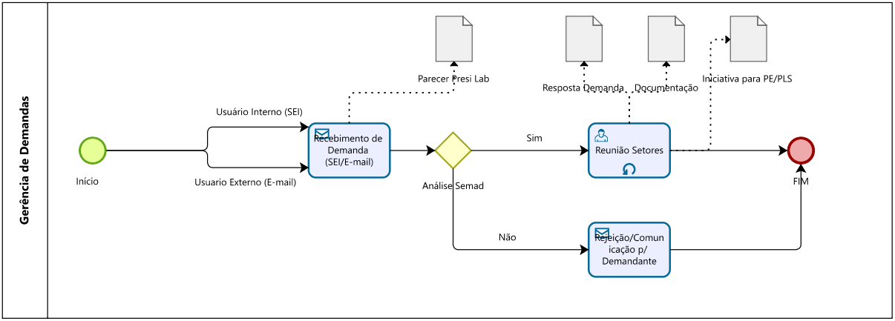

# Fluxos de Trabalho

>TODO: Texto introdutório pequeno e geral
>TODO: Testar apresentação mais visual na forma de cards

## Fluxo de Projetos

Um ou mais servidores, unidades ou Varas Federais podem iniciar demandas no LabNOVA, por meio do sistema SEI. O público externo (instituições ou cidadãos) também está autorizado a começar com um projeto, mediante o envio de e-mail para novajustica.ma@trf1.jus.br. Ainda é possível que o Laboratório instaure um projeto ex officio. Em qualquer dos casos, o interesse público merece ser verificado pelo “Nova Justiça”.

Ao ser preliminarmente admitido, um projeto percorre a fase de desenvolvimento e, em seguida, a fase de operação. Na fase de desenvolvimento, o projeto é planificado e testado por um grupo de trabalho, de preferência composto por servidores judiciários do TRF1, que também pode contar com membros externos ao TRF1, tais como usuários e advogados. Finalmente, o projeto é submetido ao coordenador do laboratório, que decide sobre o primeiro juízo de pertinência do projeto.

Entendendo que o projeto atende ao interesse público, o Coordenador do Laboratório cataloga o projeto e submete-o à homologação do DIREF. O Diretor do Foro, na altura, emitirá o segundo juízo de pertinência com relação ao projeto, aprovando-o ou rejeitando-o, dependendo da medida em que seu conteúdo corresponda a uma solução relevante. Tanto o Coordenador do LabNOVA quanto o Diretor do Foro podem sugerir mudanças para melhorar o projeto antes de emitir as suas manifestações.

Uma vez aprovado, o projeto entra na fase de operação, quando é, de fato, colocado em prática por unidades judiciais ou administrativas do SJMA de maneira estável e permanente. Nessa mesma fase, acontece a disseminação do projeto para o maior número possível de unidades que encontram no projeto uma possibilidade para superar uma necessidade.

Ao fim da fase operacional, o LabNOVA mede o êxito do projeto a partir do feedback de servidores, advogados e usuários afetados pela mudança. Mesmo após concluído, o projeto continua catalogado e disponível para compartilhamento com unidades judiciais e administrativas interessadas, sejam elas internas ou externas à SJMA.

Para o planejamento e implementação do projeto, haverá incentivos para o uso de novas tecnologias, inteligência artificial e cases de inovação bem sucedidos nos setores público e privado. Nessa atmosfera, o “Nova Justiça” predispõe-se a incubar mudanças verdadeiramente transformadoras e positivas para o sistema de justiça federal.

## Fluxo de Gerência de Demandas

